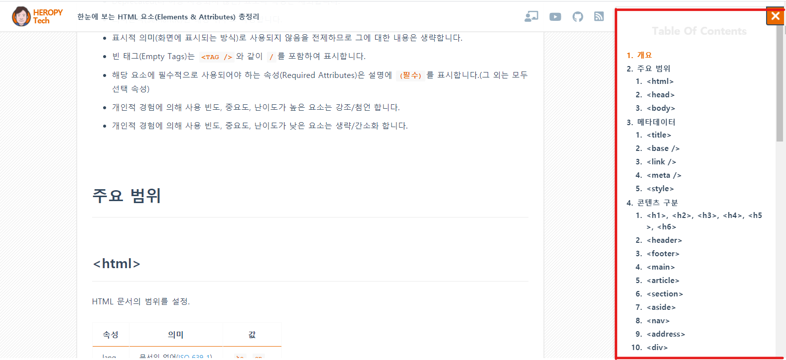
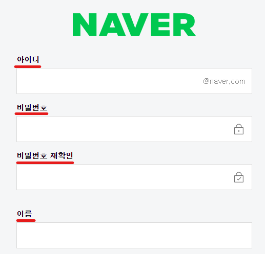
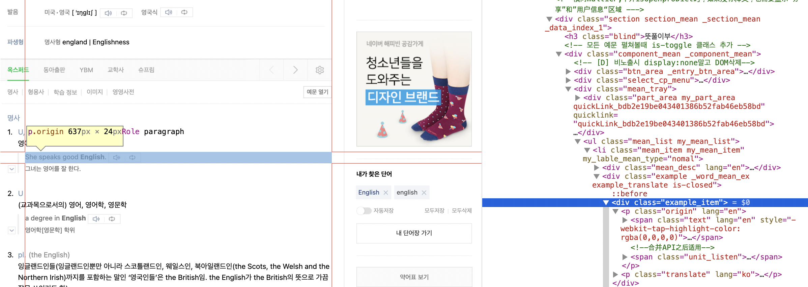

# WCAG 2.1
WCAG 는 웹 콘텐츠의 접근성을 향상시키기 위한 권고안입니다. 이 지침은 전맹, 저시력, 청각 장애, 청각 손실, 운동 장애, 언어 장애 등의 문제가 있는 사람 뿐 아니라, 학습 장애, 인지 능력 장애가 있는 사람까지 컨텐츠에 쉽게 접근할 수 있게 됩니다. 

WCAG의 각 원칙을 지키기 위해서는 여러가지 지침을 지켜야 하고, 해당 지침들은 특정 적합 기준을 이용해서 테스트 가능하게 만들어져 있습니다. 

## WCAG 2.0 과의 차이
WCAG 2.1 은 WCAG 2.0의 보완 버전입니다. 때문에 WCAG 2.0을 더 이상 사용하지 못하거나 하지는 않습니다. 하지만 W3C 는 WCAG의 최신 버전을 사용할 것을 권고하고 있습니다.

## 가이드 종류
WCAG 2.1은 광범위한 사용자(웹 디자이너, 개발자, 정책 입안자) 를 지원하기 위해 전반적인 원칙을 정하고, 이를 지키기 위한 지침을 정의합니다. 또한 이런 지침을 지키고 있는지 아닌지 명학하게 하기 위하여, 적합 기준 등을 제공해 이를 테스트할 수 있게 만들어줍니다. 
### 원칙
원칙은 웹 접근성의 기초를 다루기 위해 정해졌습니다. 총 네 가지의 원칙이 있고, 그 원칙은 인지 가능, 조작 가능, 이해 가능, 견고함이 있습니다. 
### 지침
지침은 위의 4가지 원칙을 지키기 위한 13개의 지침이 있습니다. 이 지침들은 기본적으로 접근성 좋은 컨텐츠를 사용자에게 제공하기 위한 목표가 됩니다. 
### 적합 기준
해당 13개의 지침을 맞추고 있는지 개발자는 확인을 할 필요가 있습니다. 이를 위해 WCAG 는 해당 지침을 맞추는 것을 확인하기 위한 적합 기준을 제공합니다. 또한 이런 지침을 어떤 수준으로 맞추고 있는지도 3단계에 나눠서 제공합니다.

#### 목차
1. [인지 가능](#1-인지-가능)
2. [조작 가능](#2-조작-가능)
3. [이해 가능](#3-이해-가능)
4. [견고함](#4-견고함)

## 2. 조작 가능
사용자 인터페이스 컴포넌트와 탐색은 조작할 수 있어야 합니다.

### 2.1 키보드 접근성
모든 콘텐츠의 기능을 키보드로 이용할 수 있게 해야 합니다.

#### 2.1.1 키보드

Level A

모든 콘텐츠의 기능들은 키보드 인터페이스를 통해 특정한 지연시간 없이 조작할 수 있어야 합니다. 단, 마지막 지점(endpoint)만이 아니라 사용자의 이동 경로에 따라 입력을 달리해야 하는 경우는 제외됩니다.

이 기준의 목적은 가능한 경우 키보드 또는 키보드 인터페이스를 활용하여 콘텐츠를 조작 할 수 있도록 하는 것입니다. 이를 통해 마우스 사용이 불편한 사용자 및 화면에 표시되는 작은 마우스 포인터를 찾기 어려운 사용자가 도움을 받을 수 있습니다.

**예시**

||
|:--:|
|네이버 메인 페이지|

네이버 메인 페이지에서 tab을 이용해 탐색을 시도할 시 왼쪽 위에 현재 탭의 위치가 보여진다.

#### 2.1.2 키보드 함정 제거

Level A

어떠한 항목으로 키보드 인터페이스를 통해 포커스를 옮길수 있다면 키보드를 통해서 그 초점을 해제할 수 있어야 합니다. 만약 방향키, 탭키, 혹은 일반적인 종료 방법을 통해서 해제할 수 없다면 해제하는 방법에 대한 명시가 사용자에게 제공되어야 합니다.  

이 기준의 목적은 웹 페이지 콘텐츠의 하위 컨텐츠로 키보드 포커스가 트랩되지 않도록 하는 것입니다.
이를 통해 키보드 혹은 키보드 인터페이스만을 의지해야 하는 사용자들이 웹의 모든 콘텐츠를 정상적으로 이용할 수 있게 됩니다.

#### 2.1.3 키보드 (예외 없음)

Level AAA

콘텐츠의 모든 기능은 키보드 인터페이스를 통해 어떠한 지연시간 없이 동작해야 합니다.

이 기준의 목적은 모든 콘텐츠가 키보드에서 정상 작동 할 수 있도록 하는 것입니다. 2.1.1 항목과 매우 유사하지만 예외가 허용되지 않는 차이가 있습니다. 2.1.1과 마찬가지로 이를 통해 마우스 사용이 불편한 사용자 및 화면에 표시되는 작은 마우스 포인터를 찾기 어려운 사용자가 도움을 받을 수 있습니다.

**예시**

||
|:--:|
|구글 메인 페이지|

구글에서 키보드를 이용해 사이트를 탐색시 어떠한 지연시간도 없이 빠르게 동작하는 모습을 보인다.

#### 2.1.4 문자 키 단축키

Level A

문자 (대소문자 포함), 문장 부호, 번호, 기호를 이용해 키보드 단축키를 구현한 경우 아래의 세 항목중 하나를 만족해야 합니다.
1. 해제: 단축키 해제를 진행할 수 있는 메커니즘이 존재해야 합니다.
2. 재설정: 하나 이상의 인쇄할 수 없는 키보드 키를 포함 할 수 있도록 하는 매커니즘이 존재해야 합니다.
3. 포커스 되었을때만 활성화: 컴포넌트의 키보드 단축키는 해당 컴포넌트의 포커스가 있을때만 활성화 되어야 합니다.

이 기준의 목적은 단축키의 우발적인 활성화를 줄임으로 음성을 통해 이용하는 사용자들의 편의성을 개선하고 단축키를 재설정을 할 수 있도록 하여 일부 인지 장애가 있는 사용자들에게 도움을 주는 것입니다.

**예시**

[Web Accessibility Perspectives: Voice Recognition](https://www.youtube.com/watch?v=7RHG_XiQ0ck)

해당 영상을 보면 음성 이용 사용자들이 웹 콘텐츠를 사용하는 모습을 담고 있습니다.

### 2.2 충분한 시간
사용자가 콘텐츠를 읽고 이용할 수 있도록 충분한 시간을 제공합니다.

#### 2.2.1 시간 제한 조정 가능

Level A

콘텐츠에서 설장한 시간 제한은 아래에 사항 중 하나 이상을 만족해야 합니다.
1. 해제: 사용자가 시간 제한을 해제할 수 있어야 합니다.
2. 조정: 사용자가 시간 제한을 최소 10배 이상으로 조정할 수 있어야 합니다.
3. 연장: 사용자는 시간 제한이 끝나기 최소 20초 이전에 경고 문구를 받아야 하며 이는 간단한 동작을 통해서 최소 10회 이상 연장이 가능해야 합니다.
4. 실시간 예외: 만약 실시간 진행이 필요한 경우에는 다른 대안이 없습니다.
5. 필수 예외: 시간 제한이 필수적이고 이를 연장 시 모든 부분이 유효하지 않습니다.
6. 20시간 예외: 시간 제한이 20시간이 넘는 경우입니다.

이 기준의 목적은 장애가 있는 사용자에게 웹 콘텐츠를 정상적으로 이용할 수 있도록 적절한 시간을 제공하는 것입니다. 정보를 읽거나 이해하는데 일반 사용자보다 더욱 많은 시간이 필요할 수 있는 인지 및 학습 장애가 있는 사용자들이 일시 정지를 사용하여 정보를 읽을 추가적인 시간을 확보할 수 있습니다.

**예시**

||
|:--:|
|유튜브 영상 재생 속도 설정|

유튜브에서는 사용자가 직접 재생 속도를 0.25배에서 2배까지 변경할 수 있도록 설정되어 있습니다.

추가 예시
- 티켓 구매 사이트에서 사용자가 구매한 좌석에 대해서 2분 동안 확인할 수 있는 시간이 주어지고 만약 시간 내 확인 버튼을 누르지 않은 경우 경고 메세지와 함께 사용자가 손쉽게 시간 제한을 연장 할 수 있도록 "시간 제한 연장" 버튼 팝업을 노출 시켜 시간 제한을 조정할 수 있게 합니다.

- 경매에서는 사용자가 입찰을 제출해야하는 시간에 제한이 있습니다. 특정 항목에 입찰하려는 모든 사용자에게 제한 시간이 적용되므로 특정 사용자에 대해 제한 시간을 연장하는 것은 불공평합니다. 이러한 유형의 활동에는 시간 제한이 필수적이며 기준에 따른 시간 제한의 연장, 조정 또는 비활성화가 필요하지 않습니다.

#### 2.2.2 일시 정지, 중지, 숨김

Level A

움직임, 깜빡거림, 스크롤 가능, 자동 업데이트가 되는 정보의 경우 아래 사항을 모두 만족해야 합니다.
1. 움직임, 깜빡거림, 스크롤
    만약 위에 사항들이 자동으로 시작되고, 5초 이상 지속되며, 다른 콘텐츠와 함께 표시되는 경우 필수적인 콘텐츠가 아니라면 사용자가 일시 정지 혹은 중지할수 있는 방법이 존재해야 합니다.
2. 자동 업데이트
    만약 자동 업데이트되는 정보가 자동으로 시작하고, 다른 콘텐츠와 함께 표시되는 경우 필수적인 콘텐츠가 아니라면 정보의 일시 정지 혹은 업데이트 주기를 변경할 수 있는 방법이 존재해야 합니다.

이 기준은 목적은 사용자가 웹 페이지와 상호 작용하는 콘텐츠를 마주친 경우 방해 받는 부분을 방지하고자 하는 의도를 가지고 있습니다. 
읽기 및 지정 장애가 있는 사용자 및 주의력 결핍 장애가 있는 사용자들은 깜빡이는 콘텐츠로 인해 웹 페이지의 나머지 부분과 상호 작용하는 것이 어렵거나 불가능할 수 있습니다.

**예시**

||
|:--:|
|패스트 캠퍼스 홈페이지|

패스트 캠퍼스 홈페이지에 자동으로 재생되는 애니메이션에 정지 버튼이 존재해서 언제나 사용자들에게 조작이 가능하도록 기능을 제공한다.

#### 2.2.3 시간 제약 제거

Level AAA

비대화형 동기화 미디어와 실시간 이벤트를 제외한다면 시간 제약은 콘텐츠에서 나타내는 이벤트와 작업에서 필수적인 부분이 아닙니다. 

이 기준의 목적은 시간이 지정된 콘텐츠의 발생을 최소화 하는것 입니다. 이를 통해서 시각 장애인 및 인지 장애가 있는 사용자들이 콘텐츠와 사용 작용을 할 수 있습니다. 실시간 이벤트를 제외하고는 어떠한 예외도 없다는 부분이 2.2.1과 다른 부분입니다.

**예시**

||
|:--:|
|롯데 쇼핑몰 마감 안내 공지|

선착순 이벤트의 경우 실시간으로 동작하는 콘텐츠로 시간 제약 제거가 불가능한 경우의 사례를 보여줍니다.

#### 2.2.4 인터럽트

Level AAA

비상 상황을 제외하고는 사용자가 인터럽트를 정지 시키거나 미룰 수 있어야 합니다.

이 기준의 목적은 사용자가 긴급 상황을 제외하고 작성자 혹은 서버의 알림을 무시할 수 있도록 하는것 입니다. 이를 통해 인지 장애 및 주의력 결핍 장애가 있는 사용자는 콘텐츠에 집중 할 수 있고 시각 장애가 있는 사용자는 현재 듣고 있는 콘텐츠에 초점을 유지할 수 있습니다.

**예시**

||
|:--:|
|패스트 캠퍼스 회원가입 페이지|

사용자가 계정을 생성하는 단계에서 앞으로 소식과 안내에 대한 메일 및 안내를 받는 부분에 대하여 선택권을 가질 수 있습니다.

#### 2.2.5 재인증

Level AAA

인증 세션이 만료되어도 사용자가 재인증을 하는 경우 데이터의 손실 없이 작업을 이어서 진행할 수 있어야 합니다.

이 기준의 목적은 보안상의 이유로 많은 사이트에서 일정 시간 동안 사용자의 이용이 멈추게 되면 재 인증을 요구하게 되는데 이때 데이터의 손실이 발생하게 되면 활동을 완료하는데 오랜 시간이 발생하게 되어 일반 사용자보다 오랜 시간이 소요되는 특정 그룹에 문제를 일으키게 됩니다.
이를 개선해서 인지 장애 및 시각 장애가 있어 일반 사용자보다 활동을 완료하는 데 추가적인 시간이 필요한 사용자들이 도움 받을 수 있습니다.

**예시**

||
|:--:|
|패스트 캠퍼스 재 로그인 팝업|

패스트 캠퍼스 강의를 듣는 중 다른 기기에서 접속시 재 로그인 팝업이 나오는데 이때 재 로그인을 하면 현재 듣고 있던 강의로 다시 돌아오게 됩니다.

추가 예시

손 사용이 불편한 사용자가 쇼핑 사이트에서 구매할 품목에 대해서 결제를 진행하기 위해서는 입력할 정보들이 많아 오랜 시간이 소요됩니다. 이때 결제를 진행 중 쇼핑 사이트에서 지정해놓은 시간을 초과해 재인증을 진행해도 다시 인증을 마치게 되면 동일한 정보가 입력되어 있는 상황에서 결제 프로세스가 복원되어 문제 없이 구매를 진행할 수 있습니다. 

#### 2.2.6 타임 아웃

Level AAA

사용자 활동이 없을 때 데이터가 20 시간 이상 보관되지 않는다면, 사용자의 활동이 없어서 데이터가 유실될 수 있는 상황 이전에 경고를 해줘야 합니다.

이 기준의 목적은 시간 초과가 발생해 사용자의 데이터가 유실될 수 있다면 미리 경고를 통해 이를 사용자에게 전달을 해주는 것입니다. 이 지침을 통해서 하나의 활동을 완료하는데 오랜 시간이 걸리는 언어 관련 장애가 있는 사용자 및 집중 및 주의력 결핍 장애가 있는 사용자가 도움을 받을 수 있습니다.

**예시**

[Web Accessibility Perspectives: Notifications and Feedback](https://www.youtube.com/watch?v=E1fEv4Vpexg)

해당 영상을 보면 잠시 휴식을 가진 노인분이 돌아와서 다시 주문을 진행하기 위해 정보를 입력 후 제출 버튼을 눌렀으나 입력한 데이터가 모두 사라진 모습을 담고 있습니다.

### 2.3 발작 및 신체 반응
발작 또는 신체적인 반응을 일으키는 것으로 알려져 있는 방식으로 콘텐츠를 디자인하지 않아야 합니다.

#### 2.3.1 반짝임을 세 번 또는 한계값 이하로 설정

Level A

1초에 세 번 이상 번쩍이는 것을 웹 페이지에 포함하지 않아야 하며, 섬광은 일반 섬광 및 적색 섬광 한계갑 이하로 설정해야 합니다.

이 기준의 목적은 광과민성으로 인한 사용자 발작을 유발하지 않고 웹 페이지의 콘텐츠에 액세스 할 수 있도록 하는 것 입니다. 이를 통해 번쩍이는 콘텐츠를 볼 때 발작을 일으킬수 있는 광과민성 발작 장애 사용자들에게 도움을 줄 수 있습니다.

**예시**

||
|:--:|
|구글 홈페이지|

구글 홈페이지를 확인해보면 어떠한 반짝임 및 동적 콘텐츠가 포함되어 있지 않습니다.

#### 2.3.2 세 번 번쩍임

Level AAA

1초에 세 번 이상 번쩍이는 것을 웹 페이지에 포함하지 않아야 합니다.

이 기준의 목적은 2.3.1의 항목보다 더욱 사용자의 발작 가능성을 줄이는 것입니다. 번쩍이는 자료를 보게되면 불편함을 느끼거나 발작을 일으킬 수 있는 사용자들이 발작 가능성이 적은 상태로 모든 자료를 볼 수 있으며 대체 텍스트를 통해 콘텐츠의 전체적인 이용에 불편함이 없어야 합니다.

**예시**

2.3.2와 동일한 예시

#### 2.3.3 인터랙션으로 인한 애니메이션

Level AAA

인터랙션으로 인해 재생되는 애니메이션은 정보 전달에 필수적인 기능으로 사용되는게 아니라면 비활성화 시킬 수 있어야 합니다.

이 기준의 목적은 사용자에게 웹 페이지에 애니메이션이 표시되지 않을 수 있도록 하는것 입니다. 일부 사용자는 애니메이션 콘텐츠로 인해 온전히 웹 페이지에 집중할 수 없고 매스꺼움을 경험합니다.
필수적이지 않는 애니메이션을 비활성화 시킴으로 산만, 현기증, 두통 및 메스꺼움이 발생할 수 있는 상황을 방지할 수 있습니다.

**예시**

||
|:--:|
|롯데 홈페이지|

지켜지지 않은 사례

롯데 홈페이지를 접속해 보면 필수적인 기능으로 사용되는 애니메이션이 아니지만 비활성화 시킬 수 있는 방법이 존재하지 않아 사용자가 다른 페이지로 접속하기 이전에 계속 애니메이션을 시청해야 합니다.

### 2.4 탐색성
사용자가 콘텐츠를 탐색하고, 검색하며, 자신의 위치를 확인하기 용이하도록 방법을 제공합니다.

#### 2.4.1 블록 우회

Level A

여러 웹 페이지에서 반복적으로 보여지는 콘텐츠 블록을 우회하는 방법이 존재해야 합니다.

이 기준의 목적은 사용자들이 콘텐츠를 순차적으로 진행하며 보다 직접적으로 접근 할 수 있도록 하는 것 입니다.
하나의 사이트에 여러 페이지를 방문하는 스크린 리더 사용자가 매 페이지에 노출되는 동일한 콘텐츠에 대해서 매번 들을 필요가 없게되어 웹 페이지 이용 경험에 도움을 줄 수 있습니다.

**예시**

||
|:--:|
|쿠팡 상품 검색 페이지|

쿠팡에서 상품을 검색 시 위와 왼쪽에 있는 필터를 통해 빠르게 사용자가 원하는 상품을 탐색할 수 있도록 도와준다.

#### 2.4.2 페이지 제목 설정

Level A

웹 페이지는 해당 페이지의 주제 혹은 목적을 묘사하는 제목이 있어야 합니다.

이 기준의 목적은 각 웹 페이지에 설명적인 제목이 있는지 확인하여 사용자가 콘텐츠를 찾고 그 안에서 방향을 잡도록 돕는 것 입니다.

사용자가 웹 페이지에 포함 된 정보가 자신의 요구와 관련이 있는지를 빠르게 파악할 수 있게 만들어줌으로써 모든 사용자에게 도움을 줄 수 있습니다.
시각 장애가 있는 사람들이 여러 웹 페이지가 열려있어도 콘텐츠를 차별화 해서 인지할 수 있게 됩니다.

**예시**

||
|:--:|
|패스트 캠퍼스 홈페이지의 HTML 타이틀이 일치하는 모습|

패스트 캠퍼스의 HTML 타이틀이 패스트 캠퍼스로 설정되어 있는 모습

#### 2.4.3 포커스 순서

Level A

웹 페이지를 순차적으로 탐색할 수 있어야 하고 탐색 순서가 의미나 조작에 영향을 준다면 각 컴포넌트는 의미와 조작성을 유지하는 순서로 포커스를 받아야 합니다.

이 기준의 목적은 사용자가 콘텐츠를 순차적으로 탐색 할 때 콘텐츠의 의미와 일치하고 키보드에서 조작할 수 있는 순서로 정보를 접하게 하는 것 입니다.
마우스를 사용하지 못해서 키보드를 의존하는 사용자들이 문서를 순차적으로 탐색하고 포커스 순서가 순차적 읽기 순서와 동일할 것으로 기대하는 키보드 사용자에게 사용성 개선이 됩니다.

**예시**

||
|:--:|
|구글 로그인 페이지|

사용자가 tab을 통해서 로그인을 진행하는 경우 계정 만들기가 순서상 앞에 있지만 포커스 순서를 탐색 순서에 맞춰 해당 부분에 포커스가 맞춰지기 전 로그인 프로세스를 진행할 수 있게 설계되어 있다.

#### 2.4.4 링크 목적(컨텍스트)

Level A

링크의 목적이 전반적인 사용자에게 모호한 경우를 제외하고는 링크의 텍스트 혹은 링크의 프로그래밍 방식으로 확인되는 내용으로 유추 및 확인을 할 수 있어야 합니다.

이 기준의 목적은 사용자로 하여금 각 링크의 목적을 이해하여 링크로 접속할 것인지 여부를 결정할 수 있도록 하는 것입니다.
이 방법을 통해 동작 장애가 있는 사람들로 하여금 관심없는 링크를 건너 뛰고 다음 콘텐츠를 바로 진행할 수 있게 도와줍니다.
또한 시각 장애가 있는 사용자들이 링크의 내용을 통해 해당 링크 방문 여부를 결정할 수 있게 됩니다.

**예시**

||
|:--:|
|패스트 캠퍼스 네비게이터|

패스트 캠퍼스 네비게이터를 확인 시 각각 고유한 이름으로 사용자가 알기 쉽게 링크 제목을 설정했다.

#### 2.4.5 다양한 방법

Level AA

해당 페이지가 어떤 프로세스의 결과나 단계인 경우를 제외하고, 웹 페이지 목록 내에서 웹 페이지의 위치를 찾는 방법이 하나 이상 있어야 합니다.

이 기준의 목적은 사용자가 자신이 필요로 하는 페이지를 빠르고 적합한 방식으로 찾을 수 있도록 하기 위함입니다.
시각 장애가 있는 사용자가 돋보기 혹은 스크린 리더를 통해 일일이 내용을 확인하는게 아니라 검색을 통해서 원하는 콘텐츠에 빠르게 접근할 수 있습니다.

**예시**

||
|:--:|
|구글 검색 페이지|

구글에서 검색을 진행시 최상단에 사용자가 입력한 검색 키워드가 항시 노출돼 현재 어떤 검색어의 결과를 보고 있는지 상시적으로 명시해준다.

#### 2.4.6 제목과 레이블

Level AA

제목과 레이블은 주제 혹은 목적을 설명해야 합니다. 

이 기준의 목적은 사용자가 웹 페이지에 포함 된 정보와 해당 정보가 구성되는 방식을 이해하도록 돕는 것 입니다. 명확한 제목과 설명이 있으면 사용자는 원하는 정보를 보다 쉽게 확인할 수 있고 다른 부분들의 관계를 쉽게 이해할 수 있게 됩니다.
글을 읽는데 불편함이 있는 사용자와 단기 기억 사용자들에게 명확한 설명과 제목은 포함 된 내용을 읽지 않고도 빠르게 유추할 수 있게 도와줍니다.

**예시**

||
|:--:|
|구글 검색 옵션|

구글에서 검색을 진행하면 옵션에 명확한 단어들로 각각의 링크가 어떠한 역할을 할지 설명해준다.

#### 2.4.7 포커스 표시

Level AA

키보드로 조작할 수 있는 사용자 인터페이스는 키보드 포커스 표시기가 잘 보이도록 표기해줘야 합니다.

이 기준의 목적은 사용자가 키보드 포커스가 있는 요소에 대해 시각적으로 알 수 있게 하는 것입니다. 여러 요소 중 어떤 요소에 키보드 포커스가 있는지 명확하게 알 수 있어야 합니다.
키보드를 이용해서 작업을 하는 모든 사용자에게 시각적으로 현재 어디에 위치해 있는지 알려줌으로 도움을 줄 수 있습니다.

**예시**

||
|:--:|
|로그인 탭에 포커스가 있는 상황|

네이버 로그인 페이지에서 키보드를 이용해 로그인을 진행하려고 할때 tab이 로그인 버튼에 올라가는 경우 로그인 버튼의 테두리와 포커스 테투리의 색상이 매우 유사해 사용자로 하여금 현재 어디에 위치해 있는지 어렵게 만들어 불편함을 주고 있는 모습입니다.

#### 2.4.8 위치

Level AAA

일련의 웹 페이지 내에서 사용자의 현재 위치에 관한 정보를 이용할 수 있어야 합니다.

이 기준의 목적은 사용자가 웹 페이지, 사이트, 혹은 응용 프로그램 내에서 방향을 잡고 관련 정보를 찾을 수 있도록 제공하는 것입니다.
웹 페이지에 긴 탐색 단게를 따르는게 어려운 단기 기억 사용자에게 도움을 줄 수 있습니다.

**예시**

||
|:--:|
|Heropy 블로그|

Heropy 블로그에 왼쪽 상단에 현재 내가 페이지의 내용을 몇 %정도 읽고 있는지에 대한 위치 정보가 표기되고 있는 모습이다.

#### 2.4.9 링크 목적 (링크)

Level AAA

링크의 목적이 전반적인 사용자에게 모호한 경우를 제외하고는 링크 내 텍스트만을 이용해서 각 링크의 목적을 알 수 있어야 합니다.

이 기준의 목적은 사용자가 콘텐츠에 있는 각 링크의 목적을 링크 내 텍스트를 통해 명확하게 인지하고 이를 진행할지 여부에 대해서 결정할 수 있도록 하는 것입니다.
사용자로 하여금 빠르게 링크의 역할을 파악하여 콘텐츠의 방문 여부를 결정 할 수 있도록 도와줍니다.

**예시**

||
|:--:|
|네이버 홈페이지 링크|

네이버 홈페이지 내부의 링크들은 각각의 링크에 대한 기능을 간결하게 나열함으로 사용자로 하여금 각 링크의 목적을 파악하기 쉽게 만들어준다.

#### 2.4.10 절 제목

Level AAA

절 제목을 이용해 콘텐츠를 구성해야 합니다.

이 기준의 목적은 사용자로 하여금 콘텐츠의 구성을 명확하게 이해할 수 있게 하고 콘텐츠 내에서 탐색을 용이하게 하는 것입니다.
학습 장애가 있는 사용자로 하여금 제목을 통해 페이지 콘텐츠의 전체적인 구성을 더 쉽게 이해할 수 있게 도와줄 수 있으며 키보드를 이용해 콘텐츠를 탐색하는 사람들에게 제목에서 제목으로 초점을 이동시킬 수 있게 해줌으로 빠르게 관심있는 콘텐츠를 찾을 수 있게 도와줍니다.

**예시**

||
|:--:|
|Table of Contents를 제공하는 Heropy 블로그|

Heropy 블로그의 우측에 TOC를 누르면 현재 페이지의 목차를 한 눈에 보여주는 Table of Contents를 표기해준다.

### 2.5 입력 형식
키보드 외에 다양한 입력 방법을 통해서 사용자가 보다 쉽게 기능을 조작할 수 있게 해야 합니다.

#### 2.5.1 포인터 제스처

Level A

다중 포인트 혹은 경로 기반 제스처가 필수적인 요소가 아니라면 경로 기반 체스처 없이 단일 포인터로 조작할 수 있어야 합니다.

이 기준의 목적은 일반적인 방식의 제스처를 수행할 수 없는 사용자를 위해 다양한 입력 장치 (포인터 장치, 기능 및 보조 기술)을 이용해 콘텐츠를 제어하고 이용할 수 있도록 하는 것입니다.
복잡한 제스처에 대한 사용이 어려운 인지 또는 학습 장애가 있는 사용자들에게 도움을 줄 수 있습니다.

**예시**

||
|:--:|
|윈도우 터치패드 제스처|

윈도우에 설정되어 있는 터치패드 옵션의 제스처들은 여러 손가락을 활용하여 사용하는 기능이 많고 복잡하여 인지 또는 학습 장애가 있는 사용자들이 사용하기 어려운 모습이다.

#### 2.5.2 포인터 취소

Level A

단일 포인터를 사용해 조작할 수 있는 기능의 경우, 다음 중 하나 이상을 만족해야 합니다.

1. 다운 이벤트 사용 X: 포인터의 다운 이벤트를 사용해 기능의 일부를 실행하지 않아야 합니다.
2. 중단 또는 실행 취소: 업 이벤트 시 기능이 완료되며, 완료 전에 기능을 중단하거나 완료 후에 기능의 실행을 취소할 수 있는 메커니즘이 존재해야 합니다.
3. 업 이벤트 시 되돌림: 업 이벤트가 이전 다운 이벤트의 결과를 되돌려야 합니다.
4. 필수: 다운 이벤트 시 필수적으로 기능을 완료해야 합니다.

이 기준의 목적은 사용자가 실수로 혹은 잘못된 포인터 입력을 하는 부분을 방지할 수 있도록 하는 것입니다.
모든 사용자가 잘못된 대상에 도달하는 부분을 쉽게 복구할 수 있게 도와주며 우발적인 활성화 혹은 예기치 못한 상황 발생의 가능성을 줄여줌으로 시각 장애 및 인지 장애가 있는 사용자를 도와줍니다.

#### 2.5.3 이름에 레이블 포함

Level A

텍스트 또는 텍스트 이미지를 포함하는 레이블이 있는 사용자 인터페이스 컴포넌트의 경우 이름에 시각적으로 표시되는 텍스트를 포함해야 합니다.

이 기준의 목적은 시각적으로 보여지게되는 레이블의 단어가 프로그래밍 방식으로 구성된 단어와 관련된 단어인지 확인해 주는 것입니다.
음성 입력 사용자들이 약간의 초점 변경을 통해서 페이지 내 컨트롤을 직접 활성화할 수 있게 됩니다.

**예시**

||
|:--:|
|네이버 회원 가입 페이지|

네이버 회원 가입 페이지를 보면 입력해야 하는 텍스트 위에 시각적으로 레이블의 단어가 표기되어 사용자로 하여금 쉽게 현재 단계를 인지할 수 있도록 도와줍니다.

#### 2.5.4 모션 작동

Level A

기기나 사용자 모션으로 조작할 수 있는 기능은 사용자 인터페이스 컴포넌트로도 조작할 수 있어야 하며 우발적인 작동을 방지하기 위해 모션에 대한 응답을 비활성화할 수 있어야 합니다. 단, 다음과 같은 경우는 예외로 합니다.
1. 지원 인터페이스: 모션이 접근성 지원 인터페이스를 통해 기능을 조작하는 데 사용되는 경우
2. 필수: 기능을 실행하는 데 모션이 필수적이라 비활성화 시 작업이 무효화 되는 경우

이 기준의 목적은 기기를 움직이거나 기기를 향해 몸짓하는 기능들에 대해서 사용자 인터페이스 컴포넌트로도 동작할 수 있게 도와주기 위해서 입니다.
이를 통해 기기의 이동이 불편한 상황에 놓인 사용자 혹은 물리적으로 필요한 동작을 수행하기 어려운 사용자들이 도움을 받을 수 있습니다.

**예시**

||
|:--:|
|아이폰 환경설정|

아이폰 환경설정에서는 특정 모션 작동 기능에 대해서 비활성화 할 수 있도록 옵션을 제공하고 있으며 아래 작은 텍스트로 사전 경고도 함께 안내해주고 있습니다.

#### 2.5.5 대상 크기

Level AAA

다음의 경우를 제외하고는, 포인터 입력 대상의 크기가 최소한 44 x 44 CSS 픽셀이 되어야 합니다.
1. 동등: 동일한 페이지에서 44 x 44 CSS 픽셀 이상의 동등한 링크나 컨트롤을 통해 대상을 이용할 수 있는 경우
2. 인라인: 타겟이 문장 혹은 텍스트 블록 내부에 있는 경우
3. 사용자 유저 컨트롤: 대상의 크기가 사용자로 인해 결정이 되고 제작자가 일절 수정하는 않은 경우
4. 필수: 정보를 전달하는 데 특정 표현이 필수적인 경우

이 기준의 목적은 사용자가 고정되어 있는 장치를 사용하거나 손 사용이 불편한 경우에도 사용자가 쉽게 콘텐츠를 활성화 할 수 있도록 하기 위해서 입니다.
이를 통해 섬세한 부분의 컨트롤이 어려운 사용자 및 시력이 안 좋은 사용자들이 도움을 받을 수 있습니다.

**예시**

||
|:--:|
|구글 앱 아이콘|

정사각형 형태의 큰 아이콘을 제공하는 구글 앱 아이콘 모임이다.

#### 2.5.6 동시 입력 메커니즘

Level AAA

웹 콘텐츠는 콘텐츠의 보안이 보장되거나 사용자 설정을 존중해야 하는 경우를 제외하고는 플랫폼 상에서 이용 가능한 입력 방식의 사용을 제한해서는 안됩니다.

이 기준의 목적은 사람들이 웹 콘텐츠와 상호 작용할 때 다른 입력 모드를 사용하고 전환하기 용이하도록 하는 것입니다. 
사용자로 하여금 선호되고 사용 가능한 입력 메커니즘을 통해 상호 작용할 수 있게 도와줄 수 있습니다.

**예시**

||
|:--:|
|음성 인식 검색을 지원하는 IOS|

IOS에서 검색을 진행시 키보드 터치 이외에도 음성 인식을 지원하고 있는 모습이다.

## 3. 이해 가능

정보와 UI 조작은 이해할 수 있어야 합니다.

### 3.1 가독성

Level A

텍스트 콘텐츠를 읽을 수 있고 이해할 수 있게 만듭니다.

#### Criterion 3.1.1 페이지의 언어

[How to Meet Language of Page](https://www.w3.org/WAI/WCAG21/quickref/?showtechniques=311#language-of-page)각 웹 페이지의 기본 언어를 프로그래밍 방식으로 확인할 수 있습니다.

이 적합 기준의 목적은 사용자 에이전트가 텍스트 및 기타 언어 콘텐츠를 올바르게 제시하기 위해 필요한 정보를 콘텐츠 개발자가 웹 페이지에 제공할 수 있도록 하는 것입니다. 텍스트를 합성 음성으로 변환하는 스크린 리더 기술을 사용하는 사람에게 유용합니다.

**예시**

||
|:--:|
|애플 공식 홈페이지 요소 검사 화면|

`lang="ko-KR"`을 통해 HTML에서 웹 페이지의 기본 언어를 설저애주었음을 볼 수 있습니다.

#### Criterion 3.1.2 부분의 언어

Level AA

[How to Meet Language of Parts](https://www.w3.org/WAI/WCAG21/quickref/#language-of-parts)고유명사, 기술 용어, 알 수 없는 단어의 단어, 주변 텍스트의 언어에 포함된 단어나 구절을 제외하고, 콘텐츠에 포함된 각 구절의 언어를 프로그래밍 방식으로 확인 할 수 있습니다.

이 성공 기준의 목적은 사용자 에이전트가 여러 언어로 쓰여진 콘텐츠를 올바르게 제시할 수 있도록 하는 것입니다. 문자와 알파벳 인식, 단어나 어구를 해독하고 이해하는 것이 어려운 사람들을 위해 필요합니다.

**예시**

||
|:--:|
|네이버 영어 사전|

한글로 선언된 문서 안에 영어 문자가 쓰인 부분은 `lang` 속성이 영어로 설정됨을 볼 수 있습니다.

#### 3.1.3 특이한 단어

Level AAA

[How to Meet Unusual Words](https://www.w3.org/WAI/WCAG21/quickref/#unusual-words)관용구와 전문 용어(jargon) 등 보편적이지 않거나 제한된 방식으로 사용된 단어나 구절의 구체적인 정의를 확인하기 위한 메커니즘을 이용할 수 있습니다.

장애로 인해 관용어 또는 특정한 단어의 뜻을 이해하는 것이 어려울 수 있습니다. 이러한 사람들을 위해 꼭 필요한 적합 기준입니다.

**예시**

||
|:--:|
|Environmentalists Who Changed (and Continue to Change) the World|

`WE ACT for Environmental Justice`단체에 대한 설명을 덧붙이고 있습니다.

#### 3.1.4 약어

Level AAA

[How to Meet Abbreviations](https://www.w3.org/WAI/WCAG21/quickref/#abbreviations)약어의 확장된 형태나 의미를 확인하는 메커니즘을 이용할 수 있습니다.(Level AAA)

이 적합 기준의 목적은 사용자가 약어의 원래 뜻을 알 수 있도록 하는 것입니다. 난독증이 있는 사람들에게 필요합니다.

**예시**

||
|:--:|
|First Dog in the US Tests Positive for Coronavirus|

`MESSI`라는 약어에 대한 설명을 덧붙이고 있습니다.

#### 3.1.5 읽기 수준

Level AAA

[How to Meet Reading Level](https://www.w3.org/WAI/WCAG21/quickref/#reading-level)고유명사와 제목을 제외하고 텍스트를 이해하는 데 중등 교육(중학교) 수준 이상의 독해력이 필요한 경우 이를 보완하는 콘텐츠 또는 그러한 독해력이 필요하지 않은 버전을 이용할 수 있습니다.

일반적인 지식이나 구체적인 정보를 얻기 위해 쓰는 말(텍스트나 점자에 의한 기사, 설명서, 신문 등)을 이해하고 해석하는 것이 어려운 사람들이 있습니다. 이 분들을 위해 어려운문장이나 복잡한 문장의 추가내용을 이용할 수 있도록 해야합니다.

**예시**

||
|---|
|네이처 기사 일부 발췌|

기술적인 기사에 `Abstract`를 달아줌으로써 이해를 돕습니다.

#### 3.1.6 발음

Level AAA

[How to Meet Pronunciation](https://www.w3.org/WAI/WCAG21/quickref/#pronunciation)발음을 모르면 문맥에서 단어의 의미가 모호한 경우 단어의 구체적인 발음을 확인하는 메커니즘을 이용할 수 있습니다.

이 적합 기준의 목적은 눈이 먼 사람, 시력이 낮은 사람,독해력이 없는 사람이 발음에 따라 의미가 다를 때 내용을 이해할 수 있도록 하는 것입니다.

**예시**

||
|:--:|
|다음 일본어 사전 검색 결과|

오후를 나타내는 한자를 히라가나로도 표시하여 발음을 쉽게 파악할 수 있게 합니다.

### 3.2 예측 가능성

웹 페이지가 예측 가능한 방식으로 나타나고 작동되게 합니다.

#### 3.2.1 포커스 시

Level A

[How to Meet On Focus](https://www.w3.org/WAI/WCAG21/quickref/#on-focus)컴포넌트가 포커스를 받으면 컨텍스트를 변경하지 않습니다.

이 적합 기준의 목적은 방문자가 문서를 네비게이트할 때 기능이 예측 가능함을 확인하는 것입니다. 이 적합 기준은 시각 장애, 인지 장애, 운동 장애를 가진 사람들을 지원하여 예상치 못한 상황 변화가 일어날 가능성을 줄입니다.

**예시**

||
|:--:|
|구글 로그인 화면|

계정 만들기에 포커스가 있을 때, 계정을 만드는 창을 따로 띄우지 않고 클릭이나 키보드 동작을 했을 때만 띄웁니다.

#### 3.2.2 입력 시

Level A

[How to Meet On Input](https://www.w3.org/WAI/WCAG21/quickref/#on-focus)사용자 인터페이스 컴포넌트의 설정을 변경해도 사용자가 해당 컴포넌트를 사용하기 전에 설정 변경에 관한 안내를 받지 않았다면 컨텍스트가 자동으로 변경되지 않는다.

이 적합 기준의 목적은 데이터 입력 또는 폼 제어 선택을 통해 예측 가능한 효과를 얻을 수 있도록 하는 것입니다. 인터랙티브 컨텐츠를 보다 예측 가능하게 함으로써 시각 장애 또는 인지 장애를 가진 사용자에게 혼란을 주지 않습니다.

**예제**

||
|:--:|
|구글 지원서 화면|

법적 성명을 입력하고 별명을 입력할 때, 법적 성명에 적은 내용이 변하지 않습니다.

#### 3.2.3 일관된 탐색

Level AA

[How to Meet Consistent Navigation](https://www.w3.org/WAI/WCAG21/quickref/#consistent-navigation)일련의 웹 페이지 내에서 여러 웹 페이지에 반복되는 탐색 메커니즘은 사용자가 변경을 개시하지 않는 한 반복될 때마다 동일한 상대 순서로 발생합니다.

이 적합 기준의 목적은 일련의 웹 페이지 내에서 반복적으로 콘텐츠를 조작하고 특정 정보 또는 기능을 여러 번 검색해야 하는 사용자에게 일관된 프레젠테이션과 레이아웃 사용을 장려하는 것입니다. 이 기준을 준수하면 사이트의 각 페이지에서 컴포넌트가 같은 순서로 반복되도록 함으로써 사용자는 각 페이지의 어디에 무엇이 있는지를 예측할 수 있게 됩니다.

**예제**

||
|:--:|
|우체국 홈페이지 보이스 오버 사용 화면|

우체국에서 어느 콘텐츠에 들어가 있던, `주 메뉴 바로가기`, `본문 내용 바로가기`, `하단 내용 바로가기`로 들어가고자 하는 내용에 빠르게 들어갈 수 있습니다.

#### 3.2.4 일관된 식별

Level AA

[How to Meet Consistent Identification](https://www.w3.org/WAI/WCAG21/quickref/#consistent-identification)일련의 웹 페이지 내에서 기능이 동일한 컴포넌트는 동일하게 식별합니다.

이 적합 기준의 목적은 일련의 웹 페이지에 반복적으로 표시되는 기능 컴포넌트를 일관되게 식별하는 것입니다. 이러한 식별은 사이트의 한 페이지에서 기능을 학습하면 사용자는 별도의 추가 교육 없이 다른 페이지에서 기능을 찾아볼 수 있습니다.

**예제**

||
|:--:|
|크롬 다운로드 문서|

||
|:--:|
|김데레사님 블로그 포스트 일부 발췌|

링크를 통해 넘어가는 곳에 같은 아이콘이 사용된 것을 볼 수 있습니다.

#### 3.2.5 요청 시 변경

Level AAA

[How to Meet Change on Request](https://www.w3.org/WAI/WCAG21/quickref/#change-on-request)컨텍스트의 변경이 사용자 요청에 의해서만 일어나거나 그러한 변화를 중지할 수 있는 메커니즘을 이용할 수 있다.

이 적합 기준의 목적은 사용자가 콘텍스트의 변경을 완전히 제어할 수 있는 Web 컨텐츠의 설계를 촉진하는 것입니다. 콘텍스트의 변경을 검출할 수 없는 경우, 또는 콘텍스트의 변경을 눈치채지 못한 경우에 주는 혼란을 방지할 수 있습니다.

**예시**

||
|:--:|
|네이버 프로필 수정 화면|

프로필 수정에서 별명 내용을 변경하더라도 적용 버튼을 누르기 전까진 적용하지 않습니다.

### 3.3 입력 지원

사용자가 실수를 피하고 바로잡을 수 있게 돕습니다.

#### 3.3.1 오류 확인

Level A

[How to Meet Error Identification](https://www.w3.org/WAI/WCAG21/quickref/#error-identification)입력 오류가 자동으로 감지되면 오류가 있는 항목을 식별하고 사용자에게 오류를 텍스트로 설명합니다.

이 적합 기준의 목적은 오류가 발생했다는 것을 사용자가 인식하고 무엇이 잘못되었는지를 판단할 수 있도록 하는 것입니다. 예를 들어 이메일을 적는 란에 이메일 양식이 올바르지 않음을 상기시켜 줄 수 있습니다.

**예제**

||
|:--:|
|네이버 이메일 수정 창|

이메일 형식에 맞지 않은 정보를 입력하면 이메일 형식이 올바르지 않음을 알려줍니다.

#### 3.3.2 레이블 또는 지침

Level A

[How to Meet Labels or Instructions](https://www.w3.org/WAI/WCAG21/quickref/#labels-or-instructions)사용자 입력이 필요한 콘텐츠에는 레이블이나 지침이 제공됩니다.

이 적합 기준의 목적은 콘텐츠 작성자에게 컨트롤을 식별하는 절차 또는 라벨을 제시하여 사용자가 원하는 입력 데이터를 파악할 수 있도록 하는 것입니다. 명확한 식별이나 지침은 모든 사용자들에게 올바느 정보를 입력할 수 있도록 돕습니다.

||
|:--:|
|구글 채용 경력 날짜 입력 칸|

날짜 입력에 대해서 월과 연도에 대한 힌트를 주고 있습니다. 추가로 연도에는 입력 서식에 대한 힌트도 적혀있습니다.

#### 3.3.3 오류 추천 항목

Level AA

[How to Meet Error Suggestion](https://www.w3.org/WAI/WCAG21/quickref/#labels-or-instructions)입력 오류가 자동으로 감지되고 이를 정정하기 위한 추천 항목이 있다면 그 추천 항목이 콘텐츠의 보안이나 목적을 위태롭게 하지 않는 한 이를 사용자에게 제공합니다.

이 성공 기준의 목적은 가능하면 입력 오류를 수정하기 위한 적절한 제안을 사용자에게 제공하는 것입니다. 입력 오류 수정 방법에 대한 정보를 제공하면 학습 장애를 가진 사용자가 양식에 맞게 입력할 수 있습니다.

**예시**

||
|:--:|
|데한민국 구글 검색 결과|

검색어를 '데한민국'이라고 하였을 때 '대한민국'으로 수정된 결과가 나옵니다.

#### 3.3.4 오류 방지(법률, 금융, 데이터)

Level AA

**예시**

[How to Meet Error Prevention (Legal,Financial, Data)](https://www.w3.org/WAI/WCAG21/quickref/#error-prevention-legal-financial-data)사용자에 대한 법적 책임이나 금융 거래가 발생하는 웹 사이트가 데이터 스토리지 시스템에서 사용자가 제어할 수 있는 데이터를 수정 또는 삭제하거나 사용자 테스트 응답을 제출하는 경우, 다음 중 하나 이상을 만족합니다.

- 복원 가능(Reversible): 제출 내역을 복원할 수 있습니다.
- 점검(Checked): 사용자가 입력한 데이터에 입력 오류가 있는지 점검하고 오류를 수정할 수 있는 기회를 사용자에게 제공합니다.
- 확인(Confirmed): 제출을 완료하기 전에 정보를 검토, 확인, 수정하는 메커니즘을 이용할 수 있습니다.

이 성공기준의 목적은 장애를 가진 사용자가 되돌릴 수 없는 액션을 실행할 때 실수로 인한 중대한 결과를 회피할 수 있도록 하는 것입니다.

**예시**

||
|:--:|
|무신사 구매 확정 창|

무신사에서 상품을 결제하면 배송전에 주소지를 수정할 수 있으며, 구매 확정을 하려고 하면 정보가 맞는지 검토할 수 있는 팝업창이 나타납니다.

#### 3.3.5 도움말

Level AAA

[How to Meet Error Prevention (All)](https://www.w3.org/WAI/WCAG21/quickref/#error-prevention-all)사용자가 정보를 제출해야 하는 웹 페이지의 경우 다음 중 하나 이상을 만족합니다.

- 복원 가능(Reversible): 제출 내역을 복원할 수 있습니다.
- 점검(Checked): 사용자가 입력한 데이터에 입력 오류가 있는지 점검하고 오류를 수정할 수 있는 기회를 사용자에게 제공합니다.
- 확인(Confirmed): 제출을 완료하기 전에 정보를 검토, 확인, 수정하는 메커니즘 이용할 수 있습니다.

사용자가 실수를 방지하도록 하는 기준입니다. 텍스트 입력 지원은 텍스트 입력이 필요한 폼이나 다른 곳에서 텍스트를 쓰기 어려운 경우에 글쓰기 장애나 지적 장애가 있는 사람들을 지원합니다.

**예시**

||
|:--:|
|11번가 회원가입 화면|

이력서를 제출하고 난 뒤, 내용을 수정할 수 있는 메커니즘을 제공합니다.

## 4. 견고함

### 4.1 호환성

보조 기술을 포함해, 현재와 미래의 사용자 에이전트와의 호환성을 극대화한다.

#### 4.1.1 파싱

Level A

[How to Meet Parsing](https://www.w3.org/WAI/WCAG21/quickref/#parsing)마크업 언어를 이용해 구현한 요소에는 완전한 시작/종료 태그가 있고, 요소의 중첩 구조는 표준에 따라 만들어지며, 요소에 중복된 속성은 포함되지 않습니다. 또한 표준에서 허용한 경우를 제외하고, 모든 ID의 값은 고유합니다.

이 적합 기준의 목적은 지원 기술을 포함한 사용자 에이전트가 콘텐츠를 정확하게 해석 및 해석할 수 있도록 하는 것입니다.

참고

닫는 괄호처럼 태그 형성에 필수적인 문자가 빠진 시작/종료 태그나 일치하지 않는 속성 값 물음표는 완전하지 않습니다.

**예시**

||
|:--:|
|W3C HTML 유효성 검사 결과창|

마크업 언어에서 어떠한 에러도 발생하지 않은 것을 볼 수 있습니다.

#### 4.1.2 이름, 역할, 값

Level A

[How to Meet Name, Role, Value](https://www.w3.org/WAI/WCAG21/quickref/#name-role-value)모든 사용자 인터페이스 컴포넌트(다음 항목을 포함하되 여기에 국한되지 않음: 스크립트로 생성한 폼 요소, 링크, 컴포넌트)에 대해, 이름(name)과 역할(role)을 프로그래밍 방식으로 확인할 수 있고, 사용자가 설정할 수 있는 상태(states)와 프로퍼티(properties), 값(values)을 프로그래밍 방식으로 설정할 수 있으며, 이러한 항목들이 변경되었을 때는 보조 기술을 포함한 사용자 에이전트에 알림이 제공됩니다.

이 적합 기준의 목적은 Assistive Technologies(AT; 보조 기술)가 콘텐츠 내 사용자 인터페이스 제어 상태에 대한 정보를 수집하고 활성화(또는 설정)하여 최신 상태를 유지할 수 있도록 하는 것입니다.

**예시**

||
|:--:|
|스코프 사이트의 요소 검사 이미지 화면|

`aria`속성을 이용하여 보조기기로도 웹 페이지의 각 요소의 역할이나 내용을 파악할 수 있습니다.

#### 4.1.3 상태 메시지

Level AA

상태 메시지 이해하기[How to Meet Status Messages](https://www.w3.org/WAI/WCAG21/quickref/#status-messages)마크업 언어로 구현된 콘텐츠에서 상태 메시지는 역할이나 속성을 통해 프로그래밍 방식으로 확인할 수 있으므로 포커스를 받지 않고 보조 기술로 사용자에게 제공할 수 있습니다.

이 적합 기준의 목적은 초점이 맞춰지지 않은 콘텐츠의 중요한 변경을 사용자들에게 인식시키고 불필요하게 작업을 중단하지 않도록 하는 것입니다. 상태 메시지에 적절한 역할 또는 속성이 연결되면  새로운 콘텐츠가 스크린 리더에 의해 재생됩니다.

**예시**

||
|:--:|
|보이스 오버로 구글 창 열기|

사파리에서 새탭을 열고 구글을 검색하고 들어오면 새탭이 구글로 전환되고 텍스트 상자에 메시지를 입력할 수 있다는 것을 사용자에게 알려줍니다.

참고자료

<a href="https://nuli.navercorp.com/community/article/1132999%22%3EWCAG" >2.1 한글 번역</a>
 
<a href="https://www.w3.org/TR/WCAG21/#background-on-wcag-2%22%3EW3C"> WCAG 2.1</a>
 
<a href="https://www.11st.co.kr">11번가</a>
 
<a href="https://www.apple.com">애플</a>
 
<a href="https://dic.daum.net">다음 어학사전</a>
 
<a href="https://seulbinim.github.io/WSA/table.html#scope-id-headers-속성">테이블 관련 요소</a>
 
<a href="https://www.discovery.com/nature/environmentalists-who-changed--and-continue-to-change--the-world">Environmentalists Who Changed (and Continue to Change) the World</a>
 
<a href="https://www.discovery.com/nature/first-dog-in-the-us-tests-positive-for-coronavirus">First Dog in the US Tests Positive for Coronavirus</a>
 
<a href="https://www.google.com">google</a>
 
<a href="https://www.musinsa.com">무신사</a>
 
<a href="https://www.nature.com/articles/s41467-020-19623-x">Associations between blood type and COVID-19 infection, intubation, and death</a>
 
<a href="https://naver.com">네이버</a>
 
<a href="https://www.epost.go.kr/main.retrieveMainPage.comm">우체국 홈페이지</a>
 
<a href="https://www.scope.org.uk">스코프 홈페이지</a>
 
<a href="https://www.w3.org">W3C 홈페이지</a>
 
<a href="https://inviqa.com/blog/web-accessibility-examples-5-sites-doing-it-right">Web accessibility examples: 5 sites doing it right</a>
 
<a href="https://a11y.gitbook.io/wcag/2-operable/2.2-enough-time">야무 강사님 블로그</a>
 
<a href="https://www.youtube.com/channel/UCU6ljj3m1fglIPjSjs2DpRA">W3C 유튜브</a>
 
<a href="https://www.lotteshopping.com/">롯데 쇼핑몰</a>
 
<a href="https://fastcampus.co.kr/">패스트 캠퍼스</a>
 
<a href="https://www.coupang.com/">쿠팡</a>
 
<a href="https://heropy.blog/">HEROPY 블로그</a>

