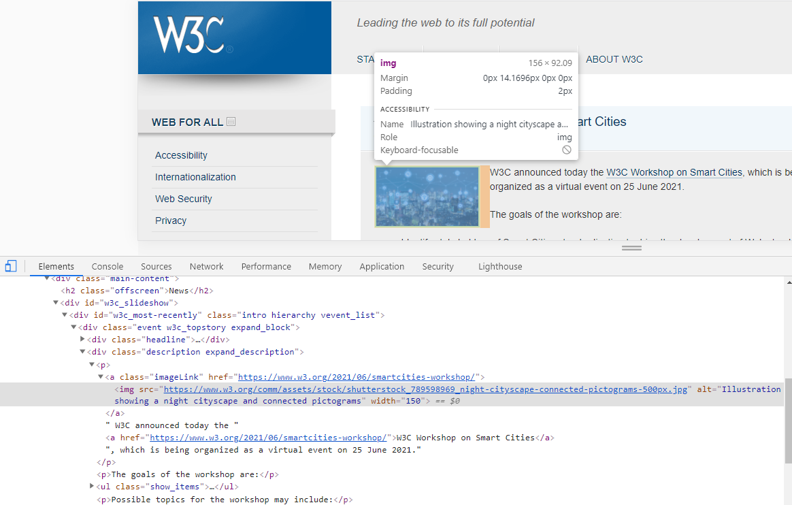
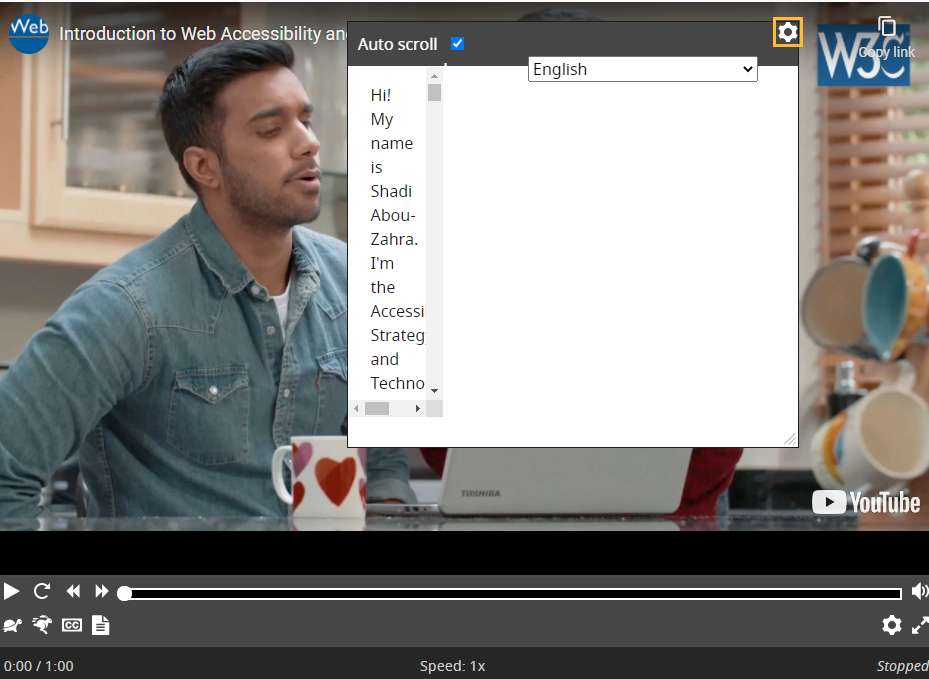
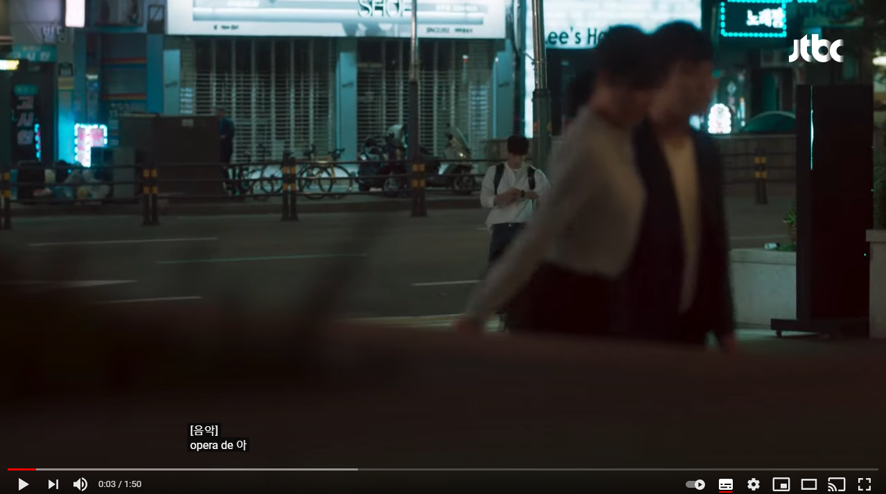
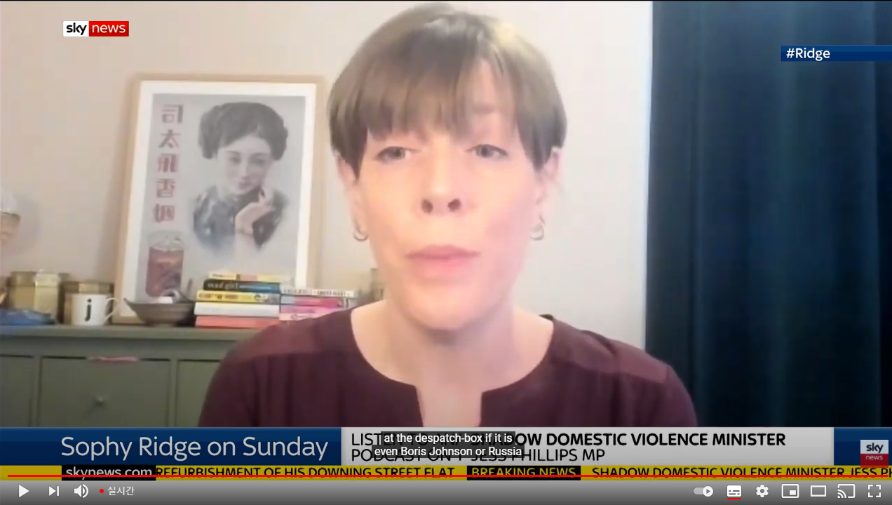
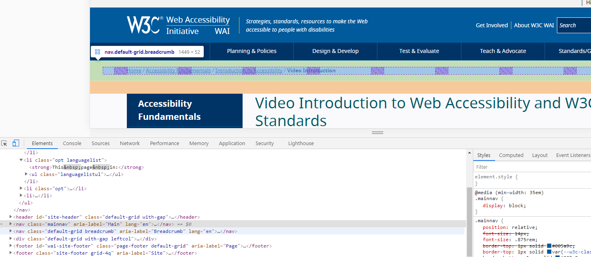
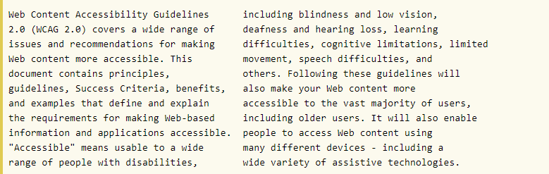
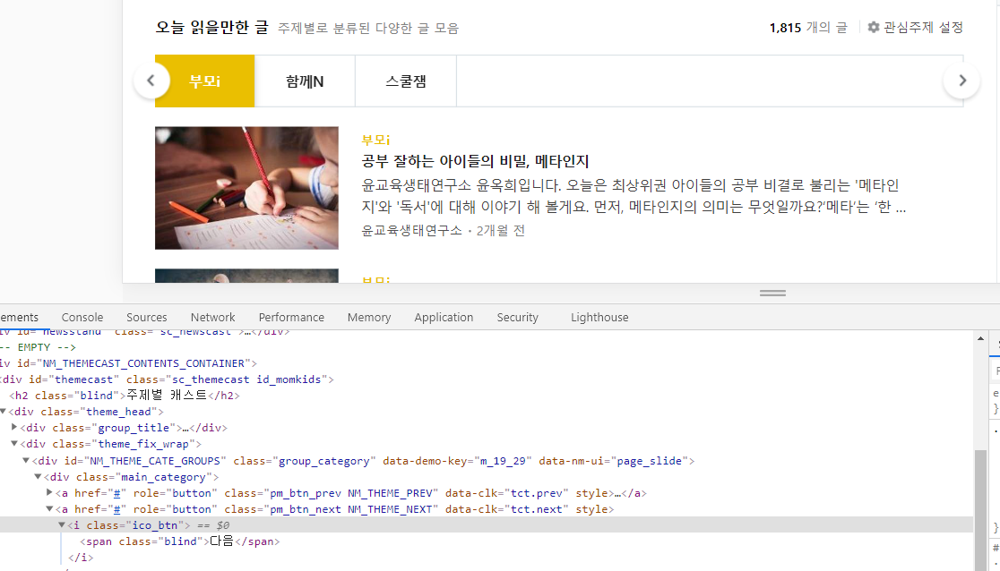
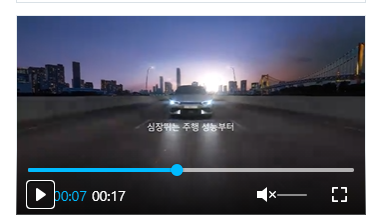
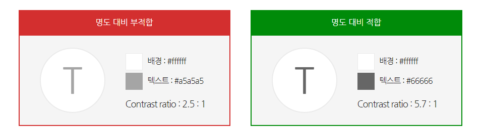

## 1. 인지 가능

접근성의 첫번째 원칙은 웹에서 제공하는 정보와 인터페이스는 사용자가 반드시 인지할 수 있어야 한다는 것입니다.

### 1.1 대체 텍스트

인지 가능성을 지키기 위한 첫번째 지침은 대체 텍스트 입니다. 텍스트가 아닌 컨텐츠에 대체 텍스트를 제공해야 합니다.

#### 1.1.1 비텍스트 컨텐츠

Level A

현재 제공 중인 비텍스트 컨텐츠가 대체 텍스트를 제공한다면 A단계의 적합 기준을 맞춘것입니다. A단계의 적합기준이란, 최하의 적합기준을 말합니다.
해당 비텍스트 컨텐츠가 의미 없이 장식을 나타낼 경우 대체 텍스트를 지정만 해주고 내용은 넣지 않는 식으로 구현할 수 있습니다.
이 기준의 목적은 대체 텍스트를 사용하여 텍스트가 아닌 컨텐츠가 전달하는 정보에 액세스 할 수 있도록하는 것입니다.
해당 적합 기준은 시각적 컨텐츠를 인식하는 데 어려움이있는 사람들에게 여러가지 수용 방법으로 변환하는데 도움을 줍니다.

**예시**

|  |
| :-------------------------------------------------------------------: |
|                           w3c의 이미지 표현                           |

위 예시를 보면 대체 텍스트에 이미지 내용을 자세하게 설명하고 있는 것을 볼 수 있습니다. 단순하게 어떤 이미지라고 명시하는 것이 아니라 자세하게 설명을 하는 것이 대체텍스트가 제대로 역할하는 것이라 할 수 있습니다.

### 1.2 시간 기반 미디어

시간이 흐르면서 컨텐츠가 진행 되는 것을 시간 기반 미디어라 합니다. 특히 오디오나 비디오를 칭합니다.

#### 1.2.1 오디오 전용 및 비디오 전용

Level A

비디오의 경우 시각적인 부분에 불편이 있는 사람들을 위해 오디오 전용 미디어를 제공해야 하고, 오디오의 경우 청각적인 부분에 불편이 있는 사람들을 위해 비디오 전용 미디어를 제공해야 합니다.
이 기준은 목적은 모든 사용자가 미리 녹음 된 오디오 전용 및 미리 녹음 된 비디오 전용 컨텐츠로 전달되는 정보를 제공하는 것입니다.
이 기준은 시각적 컨텐츠를 인식하는 데 어려움이있는 사람들에게 도움을 줄 수 있습니다.

**예시**

|  |
| :--------------------------------------------------------------------------------------: |
|                                    w3c의 동영상 예시                                     |

해당 예시를 보면 비디오의 내용을 따로 스크립트로 만들어 제공하고 있습니다. 또한 비디오에 기본적으로 오디오를 포함시켜 오디오와 비디오에 접근할 수 없는 사람들을 위한 컨텐츠를 제공하고 있습니다.

#### 1.2.2 캡션(녹음/녹화)

Level A

모든 오디오 컨텐츠에 캡션(자막)을 제공합니다. 이 기준의 목적은 청각 장애가 있거나 청각 장애가있는 사람들이 녹화 미디어를 볼 수 있도록하는 것입니다.

**예시**

|  |
| :----------------------------------------------------------------------------------------: |
|                                    youtube의 일반 영상                                     |

유튜브의 경우 자동 번역 자막 기능을 제공하여, 현재 비디오의 상황 및 이야기에 대한 대체물을 제공합니다.

#### 1.2.3 오디오 설명 또는 대체 미디어

Level A

컨텐츠가 비디오인 경우 오디오 설명으로 대체 미디어를 제공해야 합니다.

#### 1.2.4 캡션(라이브)

Level A

녹음이나 녹화된 컨텐츠가 아닌 라이브의 경우 어떤 컨텐츠인지 설명하는 캡션이 제공되어야 합니다.

**예시**

|  |
| :------------------------------------------------------------------------------------: |
|                                   유튜브의 cnn 채널                                    |

유튜브의 경우 약 1만명이 넘는 실시간 시청자가 있는 경우 자동 제작 자막을 제공합니다. 실시간 자막의 경우 실시간으로 자막을 생성해내야 하기 때문에, 기술적으로 뛰어난 업체만이 이를 제공할 수 있게 됩니다.

#### 1.2.5 오디오 설명

Level AA

사전 녹화된 비디오에 오디오 설명이 제공되면 AA 단계의 접근성을 갖게 됩니다.

#### 1.2.6 수화

Level AAA

녹음된 모든 오디오 컨텐츠에 수화 통역을 제공하면 AAA 단계의 접근성을 가지게 됩니다. 뉴스의 경우 컨텐츠 자체에 수화를 제공하는 경우가 많습니다. 웹에서 제공하는 오디오에도 자막이 붙은 경우에 level AAA의 접근성을 확보할 수 있습니다.

#### 1.2.7 확장형 오디오 설명

Level AAA

해당 비디오에 내용을 전달할 오디오 설명을 넣을 수 없을 때, 전체적인 오디오 설명을 제공해야 합니다.
이 기준의 목적은 시각 장애가 있는 사용자가 표준 오디오 설명으로 제공 할 수있는 것 이상으로 녹화된 미디어에 액세스 할 수 있도록하는 것입니다.
시각 장애가있는 사람, 화면을 볼 수없는 저시력 사람, 그리고 일어나는 일을 시각적으로 해석하는 데 어려움을 겪는인지 장애가있는 사람은 종종 시각 정보에 대한 오디오 설명을 사용합니다.
그러나 대화가 너무 많으면 오디오 설명이 불충분하기 때문에 확장 된 오디오 설명은 비디오를 이해하는 데 필요한 추가 정보를 제공 할 수 있습니다.

#### 1.2.8 대체 미디어(녹음/녹화)

Level AAA

비디오 / 오디오 미디어에 대체 방안을 제시해야 합니다.
이 기준의 목적은 시력이 너무 나빠서 자막을 읽을 수 없고 청력이 너무 나빠서 대화와 오디오 설명 을 안정적으로 들을 수없는 개인이 시청각 자료를 사용할 수 있도록하는 것입니다 .

#### 1.2.9 오디오 전용(라이브)

Level AAA

라이브 오디오 컨텐츠의 경우 동등한 정보를 보여주는 미디어를 제공해야 합니다(예: 수화)
이 기준의 목적은 대체 텍스트를 사용하여 액세스 할 수있는 화상 회의, 라이브 연설 및 라디오 웹 캐스트와 같은 라이브 오디오로 전달되는 정보를 만드는 것입니다.

### 1.3 적응성

현재 구현되어 있는 구조를 해치지 않고 다양한 레이아웃으로 만들어내야 한다는 지침입니다.

#### 1.3.1 정보와 관계

Level A

html 자체는 포함관계를 제외하고는 이미지 간의 관계를 나타낼 수 없습니다. 때문에 이런 한계를 해결하기 위해 다양한 디자인적 요소를 도입하지만 이런 정보를 제공받는데 한계가 있는 사람이나 기계는 불편함을 느낄 수 있습니다. 이를 해결하기 위해 ARIA를 도입해 사용합니다.
이 기준은 사용자가 개별 사용자의 필요에 따라 컨텐츠를 조정할 수 있도록하여 다양한 장애를 가진 사람들을 돕습니다.

**대표적인 ARIA 예시**

- role 을 사용한 역할 명시
- aria-label 을 사용한 해당 태그에 대한 설명 추가
- aria-labelledby 를 사용한 연관관계 명시

|  |
| :---------------------------------------------------------: |
|                      w3c 의 aria 표현                       |

위의 이미지처럼 aria-label 은 html 태그로는 명시할 수 없는, 해당 태그가 하는 역할이나, 관계를 나타내게 된다.

#### 1.3.2 의미있는 관계

Level A

컨텐츠의 순서가 중요하다면 반드시 순서에 맞추어서 마크업 해야 한다는 기준입니다. 디자인 때문에 마크업에서 해당 순서가 섞이는 경우가 있는데, 이런 경우가 없도록 관계성을 중시해야 합니다.
이 기준을 충족하지 않는 컨텐츠는 보조 기술이 컨텐츠를 잘못된 순서로 읽거나 대체 스타일 시트 또는 기타 서식 변경이 적용될 때 사용자를 혼란스럽게하거나 혼란을 줄 수 있습니다.
이 성공 기준은 컨텐츠를 소리내어 읽는 보조 기술에 의존하는 사람들에게 도움이 될 수 있습니다.

**실패 예시**

|  |
| :-------------------------------------------------------: |
|                 w3c 의 잘못된 마크업 예시                 |

위의 예시는 디자인을 위해 마크업을 희생한 예시입니다. 각 문단은 구별되어있는 것이 아니라, 띄어쓰기로 구별되게 만들어졌습니다. 때문에, 마크업으로만 정보를 얻을 수 있는 사용자는 해당 태그를 보면서 두개로 문단이 나누어진 것을 인식하지 못합니다. 이런 디자인을 위한 마크업 희생은 의미있는 관계 기준을 깨게 만듭니다.

#### 1.3.3 감각 특성

Level A

컨텐츠를 이용하는데 모양, 색상, 크기 등만으로 인지되면 안된다는 것입니다.
이 기준의 목적은 모든 사용자가 모양이나 크기를 인식 할 수 없거나 공간 위치 또는 방향에 대한 정보를 사용할 수없는 경우에도 콘텐츠 사용 지침에 액세스 할 수 있도록하는 것입니다.
이 기준을 충족하지 못한다면 시각 장애인 및 저시력인은 콘텐츠의 모양 또는 위치에 대한 설명을 이해하지 못할 수 있습니다.

**예시**

|  |
| :---------------------------------------------------------: |
|                        네이버의 메인                        |

위 예시를 보면 화살표 모양 만이 해당 버튼의 기능을 유추할 수 있게 만들어 줍니다. 때문에 이를 모양으로 인지하지 못하는 사람을 위해서 span 태그를 보이지 않게 추가했습니다. 이를 통해 접근성을 향상 시킨 예제입니다.

#### 1.3.4 방향

Level AA

특정 디스플레이 방향이 필수적인 경우가 아니라면, 컨텐츠를 가로 또는 세로 한 방향으로만 사용할 수 있어야 된다는 기준입니다.
일부 사용자는 장치를 고정 된 방향으로 장착합니다. (예 : 전동 휠체어의 팔에) 때문에 이런 사용자가 방향이 고정된 컨텐츠를 사용할 경우
제대로 된 사용을 못할 수 있습니다.

#### 1.3.5 입력 목적 확인

Level AAA

이 지침은 메타 데이터를 첨부 함으로써 사용자가 입력을 더 잘 할 수 있도록 돕는데 있습니다. 이름 및 이메일 주소와 같은 입력을 자동 완성할 수 있도록 구성할 수 있습니다. 자동 완성은 브라우저가 이전 입력에서 저장 한 정보와 양식 필드에서 자동 완성을 허용하는 브라우저 기능의 조합으로 작동합니다.

#### 1.3.6 목적 확인

Level AAA

이 기준의 목적은 페이지에있는 많은 요소의 목적이 프로그래밍 방식으로 결정될 수 있도록하여 사용자가 다른 양식을 사용할 수 있도록 하는 것입니다.
ARIA를 이용하여 특정 태그의 목적을 프로그래밍적으로 구현할 수 있습니다.

### 1.4 구별성

색약이나, 인지 장애가 있는 사람을 위해 배경에서 전경을 분리하는 등 핵심 컨텐츠를 잘 보고 들을 수 있게 해야 합니다.

#### 1.4.1 색 사용

Level A

정보 전달, 동작, 응답 요구 등의 기능을 색상으로만 구분하게 만들지 않아야 합니다. 정보가 이미지 (또는 기타 텍스트가 아닌 형식)의 색상 차이를 통해 전달되는 경우 색상 결함이있는 사용자에게 색상이 보이지 않을 수 있습니다.

**예시**

- 수락을 녹색으로만, 반대를 빨강색으로만 나타내서 버튼을 구성하면 안됩니다.
- 사람 모양에 빨강색, 파랑색으로만 성별을 나타내는 것은 접근성이 떨어집니다.

#### 1.4.2 오디오 제어

Level A

오디오 재생, 정지, 볼륨 제어 등의 기능을 제공해야만 합니다. 특히 이 적합 기준은 사용자가 페이지를 이용하는 전체 시간에 영향을 끼치기 때문에 반드시 지켜져야만 합니다.
화면 읽기 소프트웨어를 사용하는 개인은 동시에 재생되는 다른 오디오가 있으면 음성 출력을 듣기 어려울 수 있습니다.

**예시**

|  |
| :----------------------------------------------------------------: |
|                         네이버의 광고 영상                         |

#### 1.4.3 명암 대비

Level AA

텍스트와 텍스트 이미지의 최소 4.5: 1 의 명암비를 지원해야 합니다.
이 기준의 목적은 텍스트와 배경 사이에 충분한 대비를 제공하여 중등도 시력이 낮은 사람 (대비 강화 보조 기술을 사용하지 않는 사람)이 읽을 수 있도록하는 것입니다.
텍스트와 배경 사이에 최소 대비 비율을 제공하면 사람이 전체 색상 범위를 보지 않더라도 텍스트를 더 읽기 쉽게 만들 수 있습니다.

**예시**

|  |
| :--------------------------------------------------------------: |
|                        텍스트 명암비 관련                        |

#### 1.4.4 텍스트 크기 조정

Level AA

일반 텍스트 크기는 200% 까지 줌을 조정했을 때, 컨텐츠가 깨지지 않아야 합니다.
시각 장애가있는 사용자는 브라우저에서 웹 페이지의 텍스트 크기를 1em에서 1.2em으로 늘립니다.

#### 1.4.5 텍스트 이미지

Level AA

텍스트 이미지를 요구에 맞춰 커스터마이즈 할 수 있는 경우, 텍스트 이미지가 필수인 경우를 제외하고는 텍스트 이미지 대신 텍스트를 이용하는 것이 바람직합니다.
이 기준의 목적은 원하는 기본 시각적 표현을 달성 할 수있는 기술을 사용하는 저자가 특정 시각적 텍스트 표현이 필요한 사람들이 필요에 따라 텍스트 표현을 조정할 수 있도록 장려하는 것입니다.
이미지를 사용한다면 조정을 할 때 화질이 깨지는 현상이 있을 수 있고, 좋은 접근성을 제공할 수 없습니다.

#### 1.4.6 명암 대비

Level AAA

텍스트와 텍스트 이미지의 명암은 최소 7:1의 명암비를 지원해야 합니다.

#### 1.4.7 배경음 최소화 또는 제거

Level AAA

녹음된 오디오 전용 컨텐츠가 전경에 주요 음성을 포함하고, 오디오 CAPTCHA 나 오디오 로고가 아니며, 노래나 랩 같은 음악적 표현 용도로 제작된 소리가 아닌 경우,
배경은이 없거나, 배경음을 비활성화할 수 있거나, 20db 이하의 소리를 가져야 합니다.

청각 장애가있는 사람들은 종종 말과 배경 소리를 분리하는 데 큰 어려움을 겪기 때문에 해당 처리가 필요합니다.

#### 1.4.8 시각적 표현

Level AAA

텍스트 블록을 시각적으로 표현하기 위해 다음과 같은 메커니즘을 사용할 수 있습니다.

- 전경색과 배경색은 사용자가 선택할 수 있어야 합니다.
- 너비는 80 글자나 글리프 (CJK의 경우 40자)를 넘으면 안됩니다.
- 텍스트는 양쪽정렬이 아니어야 합니다. (왼쪽과 오른쪽 여백에 양 정렬 됨)
- 행간(단락 사이 간격)은 적어도 글자 높이의 1.5배 이상 되어야 합니다.
- 전체화면에서 컨텐츠를 읽거나, 기능을 사용하는데 문제가 없도록, 보조기술 없이
  200% 확대 하더라도 가로 방향으로 스크롤이 생기면 안됩니다.

#### 1.4.9 텍스트 이미지

Level AAA

텍스트 이미지는 순수하게 장식 용도이거나 정보를 전달하는 데 특정한 텍스트 표현이 필수적인 경우에만 사용합니다.

#### 1.4.10 재배치

Level AA

400% 까지의 확대는 가로 세로 스크롤이 동시에 발생하면 안됩니다. 이 기준의 목적은 텍스트를 확대하고 단일 열로 읽어야하는 시력이 약한 사람들을 지원하는 것입니다.

#### 1.4.11 비텍스트 명암비

Level AA

이 기준의 목적은 활성 사용자 인터페이스 구성 요소 (예 : 컨트롤)와 의미있는 그래픽이 시력이 약한 사람들이 구별 할 수 있도록하는 것입니다.
사용자 인터페이스 컴포넌트와 그래픽 개체는 인접한 색상 대비 명도대비가 3:1 이상이어야 합니다.

#### 1.4.12 텍스트 간격

Level AA

다음 텍스트 스타일 속성을 지원하는 HTML 마크업 언어를 사용하여 구현된 컨텐츠에서 다음 스타일을 모두 설정하고 다른 스타일 속성을 변경하지 않으면 컨텐츠 또는 기능이 손실되지 않습니다.

- 행간(줄 사이 간격)은 글자 크기(높이)의 1.5배 이상 이어야 합니다.
- 단락 간 간격은 글자 크기의 2배 이상으로 간격(마진)을 두어야 합니다.
- 자간(글자 사이 간격)을 글자 크기의 0.12배 이상으로 설정합니다.
- 어간(단어 사이 간격)은 글자 크기의 0.16배 이상으로 설정합니다.

#### 1.4.13 마우스로 가리키거나 키보드 포커스 시 컨텐츠

Level AA

마우스로 가리키거나 키보드 포커스 시 컨텐츠는 해제 가능하고, 포인터로 가리키기 가능하고, 지속 가능해야 합니다.
